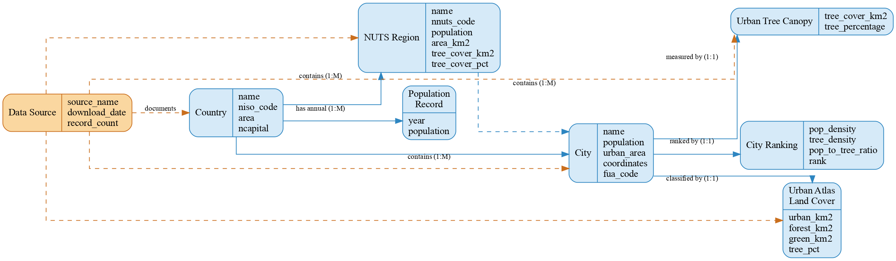

# Physical Data Model

## DBMS: SQLite 3

SQLite was chosen for its simplicity: no server setup, a single portable `.db` file, native, and Python support.

## SQL Schema

### Tables

```sql
CREATE TABLE countries (
    id INTEGER PRIMARY KEY AUTOINCREMENT,
    name TEXT UNIQUE NOT NULL,
    iso_code TEXT,
    area_km2 REAL,
    capital TEXT,
    created_at TIMESTAMP DEFAULT CURRENT_TIMESTAMP
);

CREATE TABLE regions (
    id INTEGER PRIMARY KEY AUTOINCREMENT,
    name TEXT,
    nuts_code TEXT,
    population INTEGER,
    area_km2 REAL,
    tree_cover_km2 REAL,
    tree_cover_pct REAL
);

CREATE TABLE cities (
    id INTEGER PRIMARY KEY AUTOINCREMENT,
    name TEXT NOT NULL,
    country_id INTEGER,
    capital TEXT,
    fua_code TEXT,
    population INTEGER,
    urban_area_km2 REAL,
    lat REAL,
    lon REAL,
    eTRS_x REAL,
    eTRS_y REAL,
    source TEXT,
    created_at TIMESTAMP DEFAULT CURRENT_TIMESTAMP,
    urban_area_fua_km2 REAL,
    FOREIGN KEY (country_id) REFERENCES countries(id)
);

CREATE TABLE urban_trees (
    id INTEGER PRIMARY KEY AUTOINCREMENT,
    city_id INTEGER NOT NULL,
    source_year INTEGER,
    tree_cover_pixels BLOB,
    tree_cover_km2 REAL,
    urban_mask_pixels BLOB,
    urban_mask_km2 REAL,
    tree_percentage REAL,
    created_at TIMESTAMP DEFAULT CURRENT_TIMESTAMP,
    FOREIGN KEY (city_id) REFERENCES cities(id)
);

CREATE TABLE urban_trees_ua (
    id INTEGER PRIMARY KEY AUTOINCREMENT,
    city_id INTEGER NOT NULL,
    urban_km2 REAL,
    forest_km2 REAL,
    green_km2 REAL,
    tree_pct REAL,
    rank INTEGER,
    created_at TIMESTAMP DEFAULT CURRENT_TIMESTAMP,
    FOREIGN KEY (city_id) REFERENCES cities(id)
);

CREATE TABLE city_rankings (
    id INTEGER PRIMARY KEY AUTOINCREMENT,
    city_id INTEGER NOT NULL,
    pop_density REAL,
    tree_density REAL,
    pop_to_tree_ratio REAL,
    rank INTEGER,
    created_at TIMESTAMP DEFAULT CURRENT_TIMESTAMP,
    FOREIGN KEY (city_id) REFERENCES cities(id)
);

CREATE TABLE population_annual (
    id INTEGER PRIMARY KEY AUTOINCREMENT,
    country_id INTEGER NOT NULL,
    year INTEGER NOT NULL,
    population_count INTEGER,
    FOREIGN KEY (country_id) REFERENCES countries(id),
    UNIQUE(country_id, year)
);

CREATE TABLE source_metadata (
    id INTEGER PRIMARY KEY AUTOINCREMENT,
    source_name TEXT NOT NULL,
    download_date DATE,
    record_count INTEGER,
    notes TEXT,
    created_at TIMESTAMP DEFAULT CURRENT_TIMESTAMP
);
```

### Indexes

SQLite automatically creates an index for:

- Each `PRIMARY KEY` column (unique index)
- Each `UNIQUE` constraint

No additional indexes were explicitly defined due to the small data volume.

### Constraints

| Constraint Type  | Example                               | Purpose                         |
| ---------------- | ------------------------------------- | ------------------------------- |
| PRIMARY KEY      | `countries.id`                        | Uniquely identifies each row    |
| FOREIGN KEY      | `cities.country_id → countries.id`    | Referential integrity           |
| NOT NULL         | `cities.name`                         | Ensures required fields         |
| UNIQUE           | `countries.name`                      | Prevents duplicate entries      |
| UNIQUE composite | `population_annual(country_id, year)` | One record per country per year |
| DEFAULT          | `cities.created_at`                   | Automatic timestamp on insert   |

## Data Types Used

| SQLite Type | Usage                                      | Rationale                         |
| ----------- | ------------------------------------------ | --------------------------------- |
| INTEGER     | IDs, populations, years, counts            | Exact numeric values              |
| REAL        | Areas, densities, percentages, coordinates | Floating-point measurements       |
| TEXT        | Names, codes, descriptions, timestamps     | String data                       |
| BLOB        | Pixel data arrays                          | Raw numpy arrays stored as binary |
| DATE        | Download dates                             | Date values in ISO format         |

---

# Logical Data Model

## Overview

The logical model takes the conceptual entities and turns them into a relational schema in Third Normal Form (3NF), breaking everything down to cut out redundancy while keeping data integrity intact using primary and foreign keys.

## Normalization

## 1NF

All column values are atomic. Multi-valued attributes (like a country having multiple cities) are handled through separate tables with foreign keys instead of repeating groups.

## 2NF

Every table uses a single-column primary key, so partial dependencies aren't an issue. The `population_annual` table is a slight exception — it uses `(country_id, year)` as a unique constraint but keeps a surrogate `id` as the actual primary key.

## 3NF

All non-key attributes depend only on the primary key. For example, `cities.name` depends on `cities.id`, not on `country_id`. A couple of values like `urban_trees.tree_percentage` and `city_rankings.rank` are technically derivable but are stored for query performance.

## Entity Relationship Diagram



## Table Definitions

### countries

| Column     | Type      | Constraints               | Description               |
| ---------- | --------- | ------------------------- | ------------------------- |
| id         | INTEGER   | PK, AUTOINCREMENT         | Unique country identifier |
| name       | TEXT      | NOT NULL, UNIQUE          | Country name              |
| iso_code   | TEXT      |                           | ISO 3166-1 alpha-2 code   |
| area_km2   | REAL      |                           | Total land area in km²    |
| capital    | TEXT      |                           | Capital city name         |
| created_at | TIMESTAMP | DEFAULT CURRENT_TIMESTAMP | Row creation timestamp    |

### regions

| Column         | Type    | Constraints       | Description                                                               |
| -------------- | ------- | ----------------- | ------------------------------------------------------------------------- |
| id             | INTEGER | PK, AUTOINCREMENT | Unique region identifier                                                  |
| name           | TEXT    |                   | Region/city name (may be NUTS code if unmapped)                           |
| nuts_code      | TEXT    |                   | NUTS2 statistical code (Nomenclature of Territorial Units for Statistics) |
| population     | INTEGER |                   | Population from latest Eurostat year                                      |
| area_km2       | REAL    |                   | Functional Urban Area in km²                                              |
| tree_cover_km2 | REAL    |                   | Tree cover area in km²                                                    |
| tree_cover_pct | REAL    |                   | Tree cover as percentage of area                                          |

### cities

| Column             | Type      | Constraints               | Description                   |
| ------------------ | --------- | ------------------------- | ----------------------------- |
| id                 | INTEGER   | PK, AUTOINCREMENT         | Unique city identifier        |
| name               | TEXT      | NOT NULL                  | City name                     |
| country_id         | INTEGER   | FK → countries.id         | Owning country                |
| capital            | TEXT      |                           | Capital status description    |
| fua_code           | TEXT      |                           | Functional Urban Area code    |
| population         | INTEGER   |                           | City population               |
| urban_area_km2     | REAL      |                           | Urban area extent in km²      |
| lat                | REAL      |                           | Latitude (WGS84)              |
| lon                | REAL      |                           | Longitude (WGS84)             |
| eTRS_x             | REAL      |                           | ETRS89/LAEA easting           |
| eTRS_y             | REAL      |                           | ETRS89/LAEA northing          |
| source             | TEXT      |                           | Data source identifier        |
| created_at         | TIMESTAMP | DEFAULT CURRENT_TIMESTAMP | Row creation timestamp        |
| urban_area_fua_km2 | REAL      |                           | FUA-derived urban area in km² |

### urban_trees

| Column            | Type      | Constraints               | Description                   |
| ----------------- | --------- | ------------------------- | ----------------------------- |
| id                | INTEGER   | PK, AUTOINCREMENT         | Unique measurement identifier |
| city_id           | INTEGER   | FK → cities.id, NOT NULL  | Measured city                 |
| source_year       | INTEGER   |                           | Year of the tree cover raster |
| tree_cover_pixels | BLOB      |                           | Raw pixel count of tree cover |
| tree_cover_km2    | REAL      |                           | Tree cover area in km²        |
| urban_mask_pixels | BLOB      |                           | Raw pixel count of urban mask |
| urban_mask_km2    | REAL      |                           | Urban mask area in km²        |
| tree_percentage   | REAL      |                           | Tree cover as % of urban area |
| created_at        | TIMESTAMP | DEFAULT CURRENT_TIMESTAMP | Row creation timestamp        |

### urban_trees_ua

| Column     | Type      | Constraints               | Description                      |
| ---------- | --------- | ------------------------- | -------------------------------- |
| id         | INTEGER   | PK, AUTOINCREMENT         | Unique classification identifier |
| city_id    | INTEGER   | FK → cities.id, NOT NULL  | Classified city                  |
| urban_km2  | REAL      |                           | Urban land area in km²           |
| forest_km2 | REAL      |                           | Forest land area in km²          |
| green_km2  | REAL      |                           | Green urban area in km²          |
| tree_pct   | REAL      |                           | Tree cover percentage            |
| rank       | INTEGER   |                           | Rank by tree percentage          |
| created_at | TIMESTAMP | DEFAULT CURRENT_TIMESTAMP | Row creation timestamp           |

### city_rankings

| Column            | Type      | Constraints               | Description                             |
| ----------------- | --------- | ------------------------- | --------------------------------------- |
| id                | INTEGER   | PK, AUTOINCREMENT         | Unique ranking identifier               |
| city_id           | INTEGER   | FK → cities.id, NOT NULL  | Ranked city                             |
| pop_density       | REAL      |                           | Population density (people/km²)         |
| tree_density      | REAL      |                           | Tree cover density (km² tree/km² urban) |
| pop_to_tree_ratio | REAL      |                           | Population per km² of tree cover        |
| rank              | INTEGER   |                           | Overall rank (1 = best tree equity)     |
| created_at        | TIMESTAMP | DEFAULT CURRENT_TIMESTAMP | Row creation timestamp                  |

### population_annual

| Column           | Type    | Constraints                 | Description              |
| ---------------- | ------- | --------------------------- | ------------------------ |
| id               | INTEGER | PK, AUTOINCREMENT           | Unique record identifier |
| country_id       | INTEGER | FK → countries.id, NOT NULL | Country                  |
| year             | INTEGER | NOT NULL                    | Calendar year            |
| population_count | INTEGER |                             | Population for that year |

### source_metadata

| Column        | Type      | Constraints               | Description                  |
| ------------- | --------- | ------------------------- | ---------------------------- |
| id            | INTEGER   | PK, AUTOINCREMENT         | Unique source identifier     |
| source_name   | TEXT      | NOT NULL                  | Name of the data source      |
| download_date | DATE      |                           | Date the data was downloaded |
| record_count  | INTEGER   |                           | Number of records obtained   |
| notes         | TEXT      |                           | Additional documentation     |
| created_at    | TIMESTAMP | DEFAULT CURRENT_TIMESTAMP | Row creation timestamp       |

## Foreign Key Relationships

| Source Table      | FK Column  | Target Table | Description                                 |
| ----------------- | ---------- | ------------ | ------------------------------------------- |
| cities            | country_id | countries    | City belongs to a country                   |
| urban_trees       | city_id    | cities       | Tree cover measurement belongs to a city    |
| urban_trees_ua    | city_id    | cities       | Land cover classification belongs to a city |
| city_rankings     | city_id    | cities       | Ranking belongs to a city                   |
| population_annual | country_id | countries    | Population record belongs to a country      |

---

# Conceptual Data Model

## Overview

The conceptual model gives a high-level overview of the entities and relationships involved in the European Urban Tree Cover analysis, covering how population centers, administrative regions, and environmental measurements all connect to each other.

## Entities (8)

### 1. Country

A European nation. Countries contain NUTS regions and cities, and maintain annual population records.

**Attributes:** name, ISO code, area (km²), capital city

### 2. NUTS Region

A NUTS2 statistical region defined by Eurostat. These are the primary analytical units for tree cover comparison. Some regions are metropolitan (mapped to a city name) while others are non-metropolitan.

**Attributes:** name, NUTS code, population, area (km²), tree cover (km²), tree cover (%)

### 3. City

A major European urban center. Cities serve as the link between population data and environmental measurements.

**Attributes:** name, population, urban area (km²), coordinates (latitude/longitude + ETRS projection), FUA code

### 4. Urban Tree Canopy

Tree cover measurements derived from the Copernicus Tree Cover Density 2015 raster at 20m resolution. Represents actual tree canopy within the urban footprint.

**Attributes:** tree cover pixels, tree cover (km²), urban mask pixels, urban mask (km²), tree percentage, source year

### 5. Urban Atlas Land Cover

Land cover classification from the Copernicus Urban Atlas 2021. Provides broader context including forest and green urban areas.

**Attributes:** urban area (km²), forest area (km²), green urban area (km²), tree percentage, rank

### 6. City Ranking

Derived metrics ranking cities by tree density and population-to-tree ratios.

**Attributes:** population density, tree density, population-to-tree ratio, rank

### 7. Population Record

Annual population counts for each country.

**Attributes:** year, population count

### 8. Data Source

Metadata documenting the origin of each dataset used in the project.

**Attributes:** source name, download date, record count, notes

## Relationships

| Relationship                  | Type | Description                                    |
| ----------------------------- | ---- | ---------------------------------------------- |
| Country → NUTS Region         | 1:M  | A country contains multiple NUTS regions       |
| Country → City                | 1:M  | A country contains multiple cities             |
| Country → Population Record   | 1:M  | A country has annual population records        |
| NUTS Region → City            | 1:M  | A region contains multiple cities (conceptual) |
| City → Urban Tree Canopy      | 1:1  | A city has one tree cover measurement          |
| City → Urban Atlas Land Cover | 1:1  | A city has one land cover classification       |
| City → City Ranking           | 1:1  | A city has one ranking entry                   |
| Data Source → (all entities)  | M:N  | Each source documents multiple entities        |

## **Why This Model**

This model works well because it:

1. Keeps administrative units (Country, NUTS Region) separate from physical measurements (Urban Tree Canopy, Urban Atlas Land Cover), making it easy to analyze data at different geographic levels.
2. Links population data (Population Record, City) to environmental data (tree cover, land cover), which is central to answering the research question about equity between population and tree cover.
3. Tracks where data comes from through the Data Source entity, keeping the analysis reproducible.
4. Supports hierarchical analysis, country to region to city, with consistent foreign key relationships throughout.

---

# Dataset Summary

## Case Study

**How do European NUTS2 regions compare in urban tree cover relative to their population?**

This project analyzes the relationship between population density and tree canopy cover across European metropolitan regions, using data from Copernicus (tree cover density, urban land cover), Eurostat (population), and Wikipedia (city data).

## Dataset Structure

The database contains 8 tables with a total of 433 records across all entities.

### Entities Overview

| Entity                 | Table               | Rows | Description                                     |
| ---------------------- | ------------------- | ---- | ----------------------------------------------- |
| Country                | `countries`         | 51   | European countries with ISO codes and area      |
| NUTS Region            | `regions`           | 212  | NUTS2 regions with population and tree cover    |
| City                   | `cities`            | 30   | Major European cities with coordinates          |
| Urban Tree Canopy      | `urban_trees`       | 30   | Tree cover from Copernicus TCD 2015 raster      |
| Urban Atlas Land Cover | `urban_trees_ua`    | 29   | Land cover classification from Urban Atlas 2021 |
| City Ranking           | `city_rankings`     | 28   | Rankings based on tree density metrics          |
| Population Record      | `population_annual` | 51   | Annual population counts by country             |
| Data Source            | `source_metadata`   | 2    | Metadata about data sources                     |

### Key Attributes

- **NUTS Regions:** name, NUTS code, population, area (km²), tree cover (km² and %)
- **Cities:** name, population, urban area (km²), coordinates (lat/lon + ETRS projection)
- **Urban Tree Canopy:** tree cover pixels, tree cover km², tree percentage (from 20m resolution TCD raster)
- **Urban Atlas Land Cover:** urban area, forest area, green urban area, tree percentage
- **City Rankings:** population density, tree density, population-to-tree ratio, rank

## Data Sources

| Source                      | Description                                  | Records                 |
| --------------------------- | -------------------------------------------- | ----------------------- |
| Eurostat TGS00096           | NUTS population data (2014–2024)             | 227 regions             |
| Copernicus Urban Atlas 2021 | FUA boundaries in GeoPackage format          | 768 metropolitan areas  |
| Copernicus TCD 2015         | Tree Cover Density raster at 20m resolution  | 1 raster covering EU    |
| NUTS2021                    | NUTS classification with metropolitan labels | 229 entries             |
| Wikipedia                   | European country and city data               | 51 countries, 30 cities |
